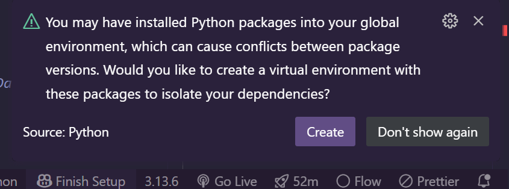

- https://colab.research.google.com/drive/1qANZCP0wA67A8S1rt2HSAqBar-RCXTDM#scrollTo=SfV8of8i9nRy
- https://www.w3schools.com/python/pandas/pandas_getting_started.asp
# PIP is a package manager for Python packages, or modules if you like.
- https://www.w3schools.com/python/python_pip.asp
- https://youtu.be/ZlMNodo0OMw?si=wb6nY5kU9V1qs5bT

