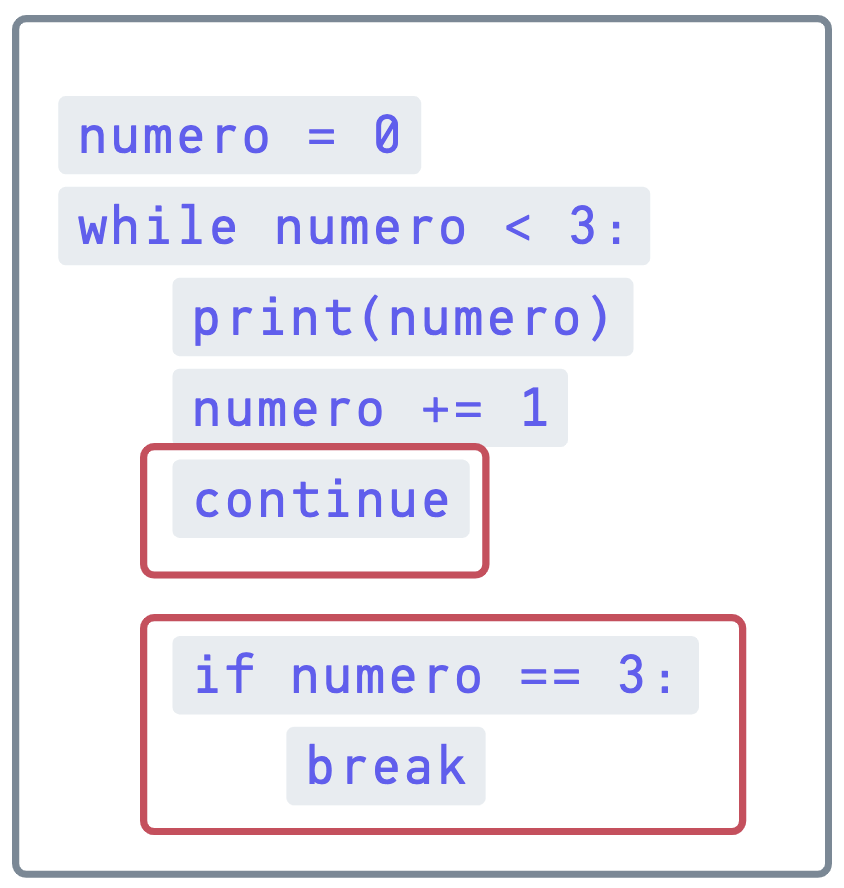

# Sesion 2
Estructuras de control:
Estructuras condicionales
- selectivas

Estructuras iterativas

Por un lado, el continue está de más. Si el bloque dentro del while llega a la última línea, simplemente vuelve
a empezar. No hace falta que le aclaremos con el continue que “tiene que volver a empezar”. El continue es
para cuando nosotros queremos forzar que vuelva a iterar. Por el otro, el if dentro del while con el break
tampoco tiene sentido. Primero, porque con el continue ahí nunca se ejecutaría y además, como dijimos más
numero < 3.
arriba, la condición es que
En el momento en el que numero llega a 3, el while deja de
cumplir con la condición, y la ejecución se corta. Por lo que el if sólo estorba, haciendo algo que ya de por sí
iba a hacer el while.

### Caso: Continue
| Iteración | `numero` al entrar | ¿Es par? | Acciones | `numero` al salir | `veces` |
|-----------|-------------------|-----------|-----------|-------------------|---------|
| 1 | 1 | ❌ | imprime `1`, suma 1 | 2 | 1 |
| 2 | 2 | ✅ | `"if, ANTES 2"`, suma 1 → `3`, `"if, DSPS 3"`, imprime `3`, suma 1 | 4 | 2 |
| 3 | 4 | ✅ | `"if, ANTES 4"`, suma 1 → `5`, `"if, DSPS 5"`, imprime `5`, suma 1 | 6 | 3 |
| 4 | 6 | ✅ | `"if, ANTES 6"`, suma 1 → `7`, `"if, DSPS 7"`, imprime `7`, suma 1 | 8 | 4 |
| 5 | 8 | ✅ | `"if, ANTES 8"`, suma 1 → `9`, `"if, DSPS 9"`, imprime `9`, suma 1 | 10 | 5 |
| 6 | 10 | ✅ | `"if, ANTES 10"`, suma 1 → `11`, `"if, DSPS 11"`, imprime `11`, suma 1 | 12 | 6 |

### Caso: Sin continue
| Iteración | `numero` al entrar | ¿Es par? | Acciones | `numero` al salir | `veces` |
|-----------|-------------------|-----------|-----------|-------------------|---------|
| 1 | 1 | ❌ | imprime `1`, suma 1 | 2 | 1 |
| 2 | 2 | ✅ | `"if, ANTES 2"`, suma 1 → `3`, salta al inicio (`continue`) | 3 | 1 |
| 3 | 3 | ❌ | imprime `3`, suma 1 | 4 | 2 |
| 4 | 4 | ✅ | `"if, ANTES 4"`, suma 1 → `5`, salta (`continue`) | 5 | 2 |
| 5 | 5 | ❌ | imprime `5`, suma 1 | 6 | 3 |
| 6 | 6 | ✅ | `"if, ANTES 6"`, suma 1 → `7`, salta (`continue`) | 7 | 3 |
| 7 | 7 | ❌ | imprime `7`, suma 1 | 8 | 4 |
| 8 | 8 | ✅ | `"if, ANTES 8"`, suma 1 → `9`, salta (`continue`) | 9 | 4 |
| 9 | 9 | ❌ | imprime `9`, suma 1 | 10 | 5 |
| 10 | 10 | ✅ | `"if, ANTES 10"`, suma 1 → `11`, salta (`continue`) | 11 | 5 |
