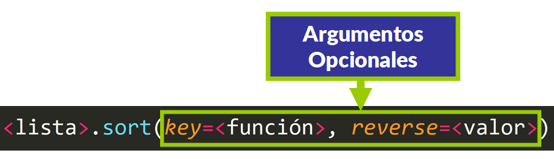

# Sesion 4
Las secuencias son un conjunto de datos 
Los string son una secuencia de caracteres
Cuando defino una variable de tipo string, no puede ser modificada. Si la modifico, lo que pasa en realidad, es que estoy obteniendo otra, a aprtir de la inicial.
a = 'V'
b = a + 'R'
Las secuencias de tipo string, son INMUTABLES, no cambian. 

# Tuplas - Otro tipo de secuencias 
- Las secuencias de tipo tuplas también, son INMUTABLES, no cambian. 
- Pueden contener distintos tipos de datos

# Listas - Otro tipo de secuencias 
- Las secuencias de tipo listas, son MUTABLES. 
- Puedo cambiar un elemento, agregar o quitar. 
- Pueden contener distintos tipos de datos

## Ordenar listas en Python: Como ordenar por descendente o ascendente.
https://www.freecodecamp.org/espanol/news/ordenar-listas-en-python-como-ordenar-por-descendente-o-ascendente/ 

**Una diferencia clave entre sort() y sorted() es que sorted() retornará una nueva lista, mientras que  sort() ordena la lista en su lugar.**

https://elcodigoascii.com.ar/
